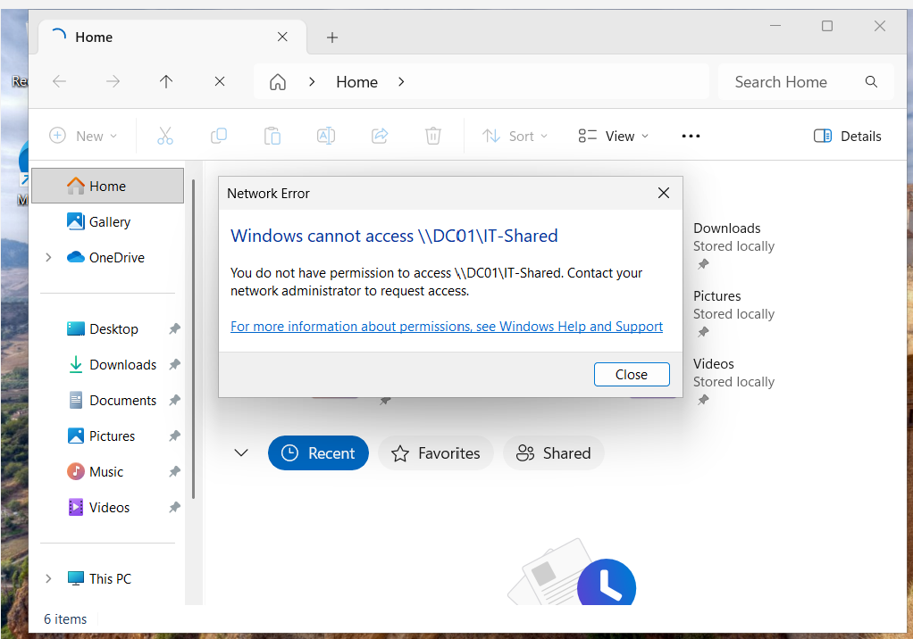
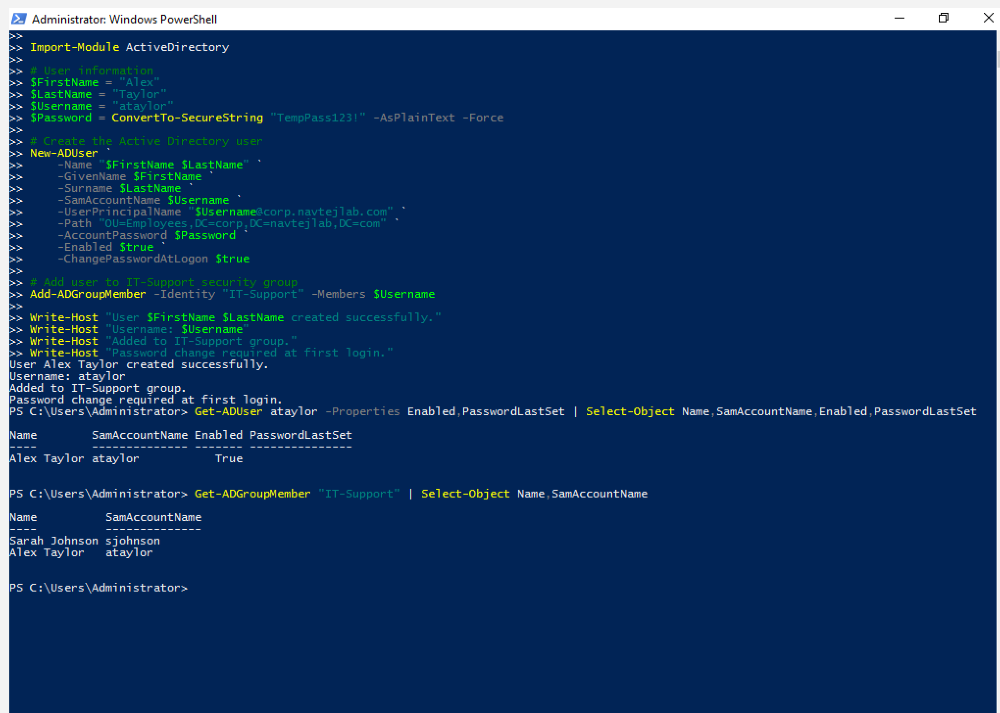

# Active Directory Help Desk Lab

**Windows Server | Active Directory | Group Policy | DNS | Windows 11 | PowerShell**

Hands-on Help Desk lab demonstrating Windows domain administration, user support, access control, structured troubleshooting, and PowerShell automation.

## Project Summary

I built a virtual Windows domain environment to practise common Level 1 and Level 2 IT Support responsibilities. In this project, I:

- Configured a Windows Server domain controller with Active Directory Domain Services and DNS
- Joined a Windows 11 workstation to the domain
- Created and managed organizational units, users, computers, and security groups
- Applied password and account-lockout policies through Group Policy
- Resolved locked, disabled, and password-related user account issues
- Configured group-based Share and NTFS permissions using least privilege
- Tested authorized access, denied unauthorized access, and mapped a network drive
- Used PowerShell to query Active Directory and automate new-user onboarding

## Lab Environment

| Component | Configuration |
| --- | --- |
| Hypervisor | Oracle VirtualBox |
| Internal network | CorpLab |
| Domain controller | DC01 — Windows Server 2016 |
| Domain | `corp.navtejlab.com` |
| Server IP and DNS | `192.168.10.10/24` |
| Client | CLIENT01 — Windows 11 Pro |
| Client IP | `192.168.10.20/24` |
| Administration tools | ADUC, Group Policy Management, DNS Manager, PowerShell |

## Selected Project Evidence

### 1. Domain Controller and Server Roles

Configured DC01 with Active Directory Domain Services and DNS to provide centralized identity, authentication, policy, and name-resolution services.


### 2. Active Directory Users, OUs, and Groups

Created an `Employees` organizational unit, test domain users, and an `IT-Support` security group. Group membership was used to manage access by role instead of assigning permissions directly to individual users.


### 3. Windows 11 Domain Join

Joined CLIENT01 to `corp.navtejlab.com` and verified that a domain user could authenticate from the workstation.


### 4. Password and Account-Lockout Policies

Configured and tested domain security policies through Group Policy:

- Minimum password length: 12 characters
- Password complexity: enabled
- Password history: 24 passwords
- Password age: 1–90 days
- Account lockout: 5 failed attempts
- Lockout duration and reset counter: 15 minutes

Applied the policy with `gpupdate /force` and confirmed enforcement from the client workstation.


### 5. Group-Based Access Control

Created the `IT-Shared` network folder, granted the `IT-Support` group Share and NTFS access, and verified both permitted and denied outcomes. An authorized user could access and modify files, while a user without the required group membership received an access-denied message.



### 6. Automated User Onboarding

Created and tested a PowerShell onboarding script that:

- Collects the employee's name and username
- Securely accepts a temporary password
- Creates and enables the account in the `Employees` OU
- Requires a password change at first logon
- Adds the user to the `IT-Support` group
- Verifies that the account was created successfully

Run the script from the repository root on the domain controller:

```powershell
.\scripts\New-ADUserOnboarding.ps1
```



The reusable script is available here: [`New-ADUserOnboarding.ps1`](scripts/New-ADUserOnboarding.ps1)

## Help Desk Scenarios Completed

| Scenario | Troubleshooting and Resolution | Result |
| --- | --- | --- |
| User could not sign in | Confirmed the error, checked connectivity and AD account status, then unlocked or reset the account as appropriate | Successful domain logon verified |
| Account locked after failed attempts | Reproduced the issue, confirmed the lockout in ADUC, unlocked the account, and retested | Access restored |
| Disabled user account | Confirmed the account state, re-enabled the user, and tested authentication | User signed in successfully |
| Shared-folder access denied | Checked group membership and effective Share/NTFS permissions | Authorized access restored; unauthorized access remained blocked |
| New employee setup | Automated account creation, OU placement, group membership, and first-logon password change | Repeatable onboarding workflow completed |

## PowerShell Administration

Used the Active Directory PowerShell module to:

- Retrieve users and account properties with `Get-ADUser`
- Check enabled, locked-out, and password-expiration status
- Verify security-group membership with `Get-ADGroupMember`
- Create users with `New-ADUser`
- Add users to groups with `Add-ADGroupMember`
- Automate a standard onboarding workflow

## Complete Documentation

This README highlights the six screenshots most relevant to a recruiter or hiring manager. Expand the section below to view the complete evidence index.

<details>
<summary><strong>View all 25 step-by-step screenshots</strong></summary>

### Domain and Identity Administration

1. [Server Manager — AD DS and DNS](screenshots/01-server-manager-ad-ds-dns.png)
2. [Active Directory — Users, OU, and Security Group](screenshots/02-active-directory-users-groups.png)
3. [IT-Support Security Group Membership](screenshots/03-it-support-group-membership)
4. [Windows 11 Client Joined to the Domain](screenshots/04-client01-domain-joined.png)
5. [Password and Account-Lockout Group Policy](screenshots/05-password-and-account-lockout-policy.png)

### Account and Authentication Troubleshooting

6. [Invalid Domain Login Attempts](screenshots/06-invalid-login-attempts.png)
7. [Account Lockout Verified in Active Directory](screenshots/07-account-lockout-verified-in-ad.png)
8. [Successful Login After Account Unlock](screenshots/08-successful-login-after-unlock.png)
9. [Password Change Required at Next Logon](screenshots/09-password-change-required.png)
10. [Successful Login After Password Reset](screenshots/10-password-reset-successful-login.png)
11. [Disabled Account Login Error](screenshots/11-disabled-account-login-error.png)
12. [Successful Login After Account Re-enabled](screenshots/12-disabled-account-reenabled-success.png)

### File Sharing and Access Control

13. [IT-Shared Folder Configuration](screenshots/13-it-shared-folder-configuration.png)
14. [IT-Support Group Share Permissions](screenshots/14-it-support-group-share-permissions-change-read.png)
15. [IT-Support Group NTFS Modify Permissions](screenshots/15-it-support-group-ntfs-modify-permissions.png)
16. [Authorized User Access to Shared Folder](screenshots/16-domain-user-access-shared-folder.png)
17. [Authorized User Write-Access Verification](screenshots/17-domain-user-write-access-shared-folder.png)
18. [Unauthorized User Access Denied](screenshots/18-unauthorized-user-shared-folder-access-denied.png)
19. [Mapped Network Drive](screenshots/19-domain-user-mapped-network-drive.png)
20. [NTFS Permission Inheritance](screenshots/20-ntfs-permission-inheritance.png)

### PowerShell Administration and Automation

21. [List Active Directory Users](screenshots/21-powershell-list-active-directory-users.png)
22. [Verify IT-Support Group Membership](screenshots/22-powershell-it-support-group-membership.png)
23. [Check Active Directory User Account Status](screenshots/23-powershell-ad-user-account-status.png)
24. [Check Active Directory User Password Status](screenshots/24-powershell-ad-user-password-status.png)
25. [Automated Active Directory User Onboarding](screenshots/25-powershell-automated-ad-user-onboarding-verification.png)

</details>

[`View all lab screenshots`](screenshots/)

## What I Learned

This project strengthened my practical understanding of centralized identity management, domain authentication, Group Policy, least-privilege access, and structured Help Desk troubleshooting. It also improved my ability to verify a resolution from the user's workstation and document the technical work clearly.

## Next Steps

- Expand DNS configuration and name-resolution troubleshooting
- Configure DHCP scopes, options, reservations, and client troubleshooting
- Build Microsoft 365 and Microsoft Entra ID administration labs
- Add ticket documentation for common Help Desk incidents

---

## Author

**Navtej Singh**  
IT Support | Help Desk | Active Directory  
Brampton, Ontario, Canada  

[GitHub Profile](https://github.com/Navtej8000)
