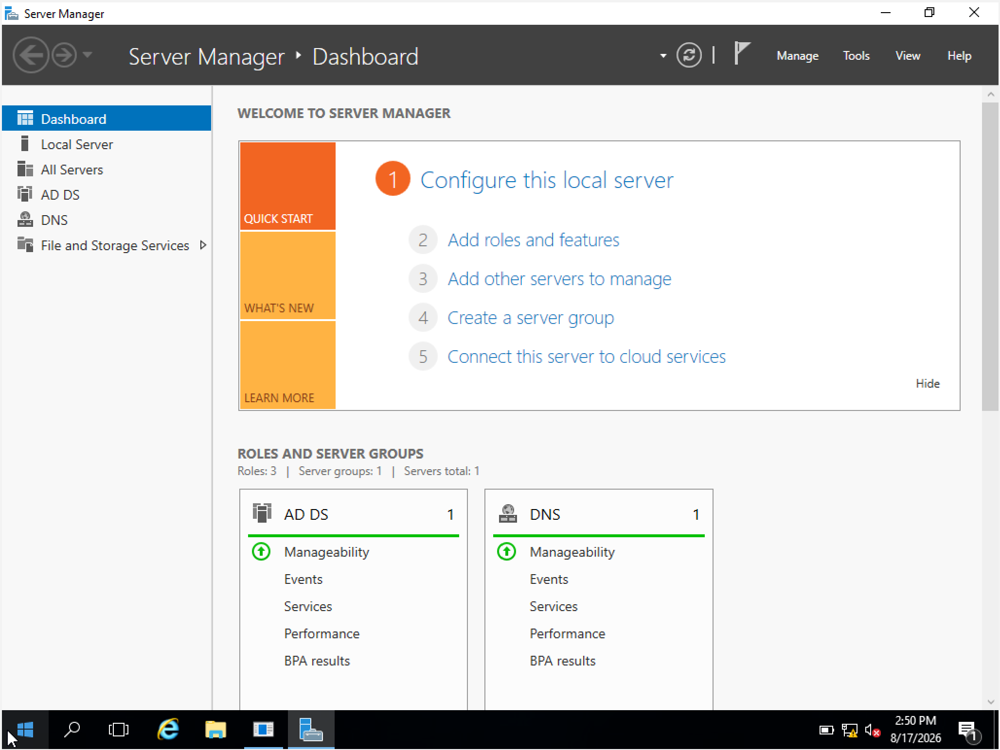
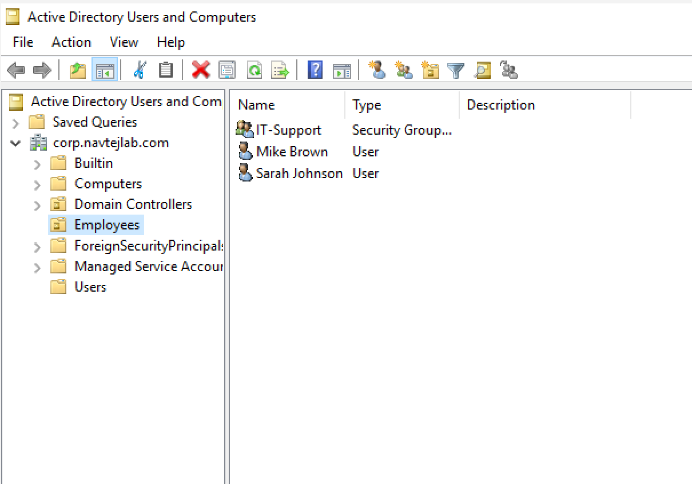
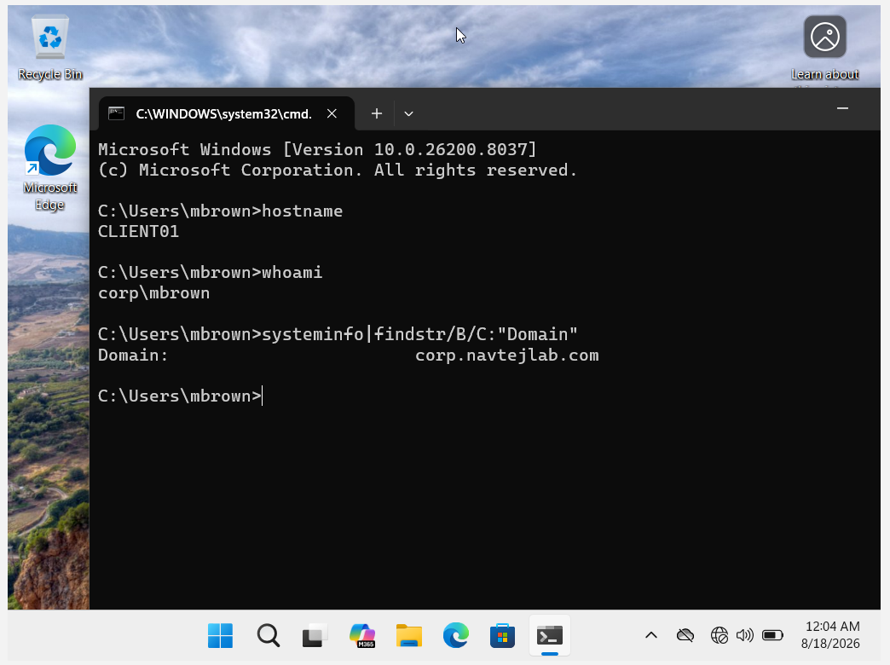
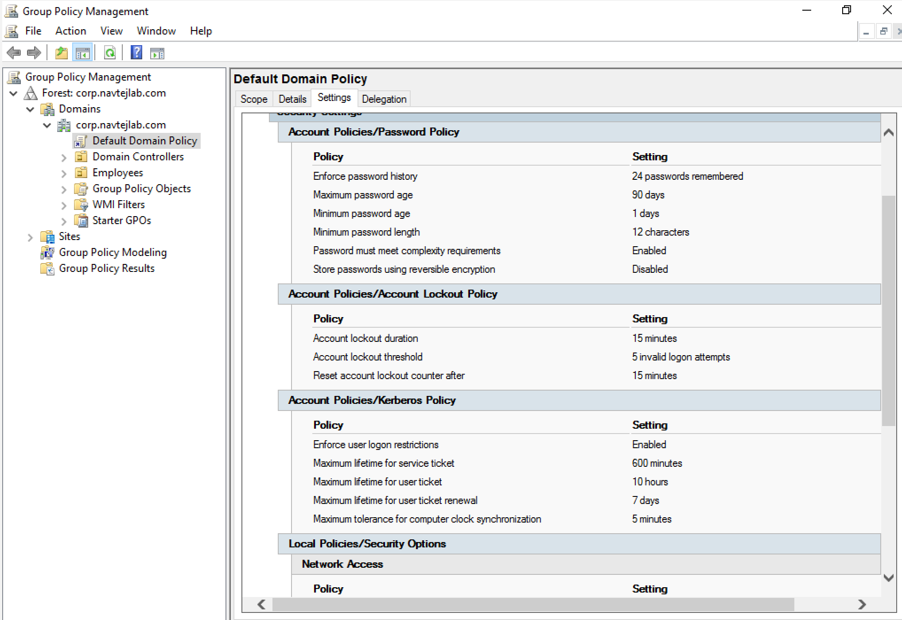
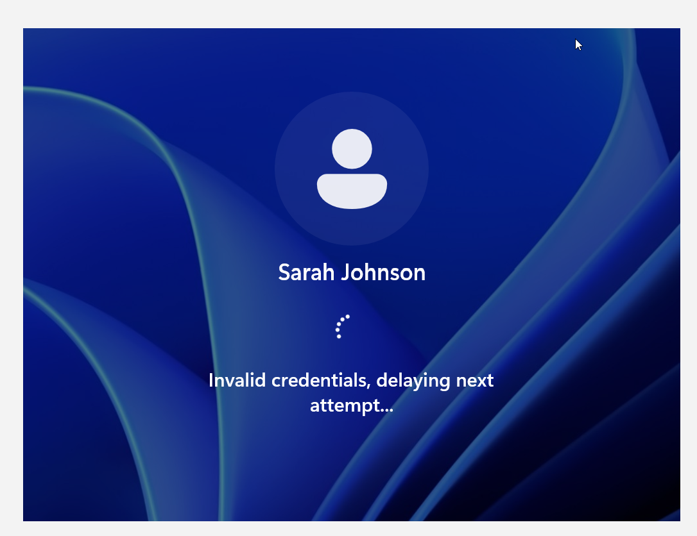
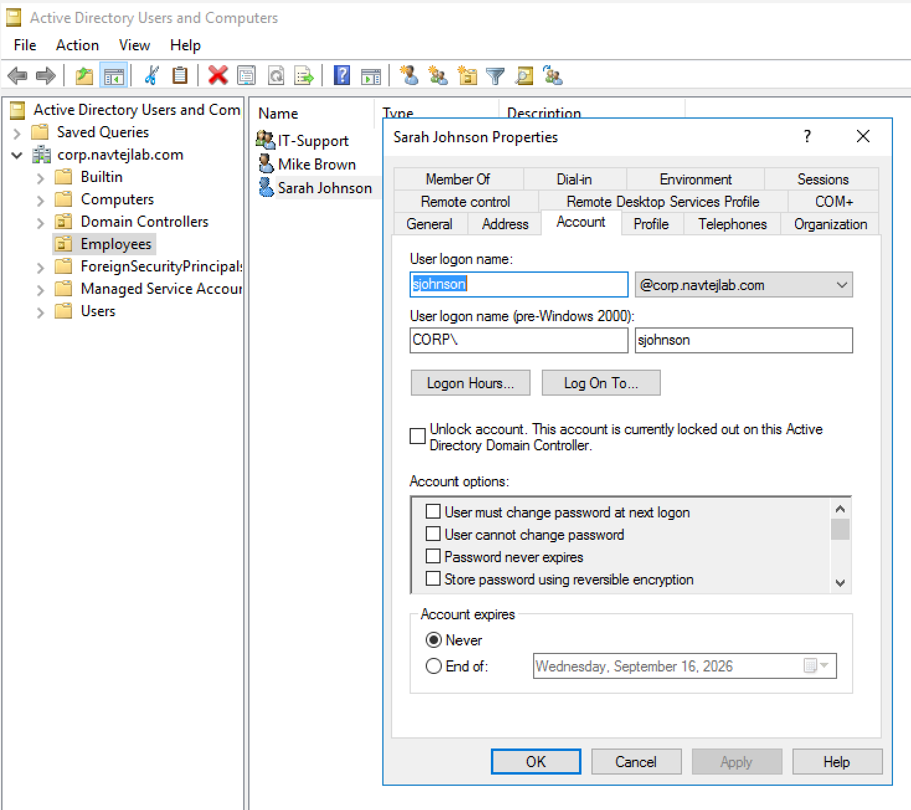
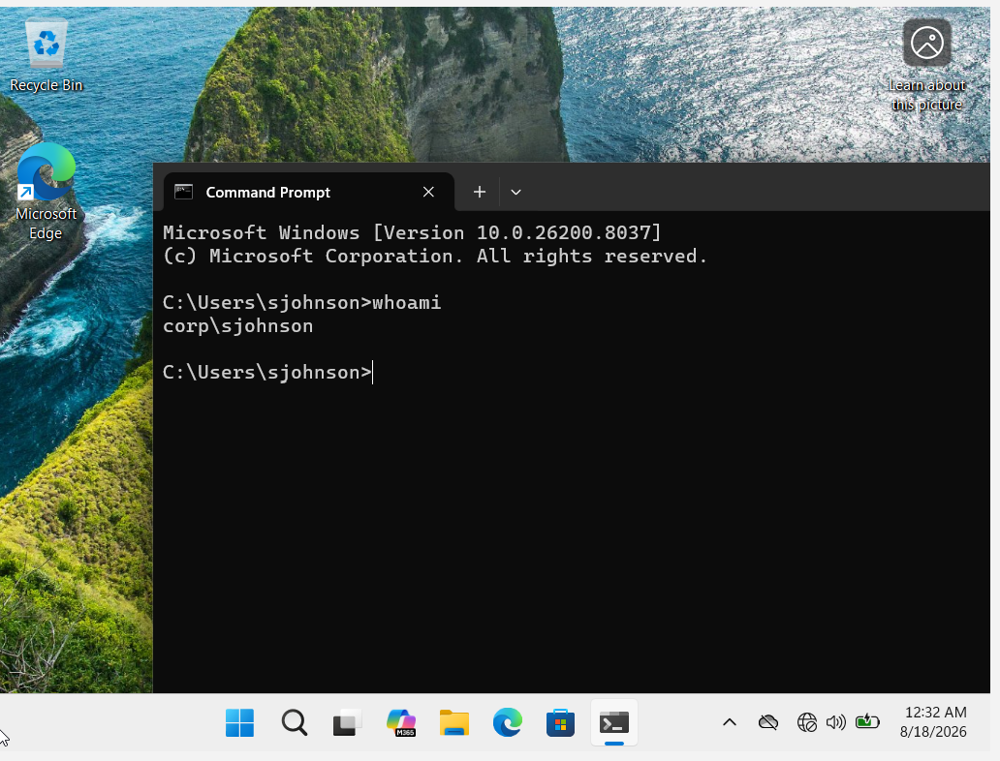

# Active Directory Help Desk Lab
Hands-on Active Directory Help Desk lab using Windows Server, Windows 11, AD DS, Group Policy, user and group management, password policies, account lockout, and troubleshooting

## Project Overview

This project documents a hands-on Active Directory home lab built to develop practical skills for Help Desk and IT Support roles.

The lab simulates a small business Windows domain environment where I configured a Windows Server domain controller, joined a Windows 11 workstation to the domain, created and managed users and security groups, configured Group Policy security settings, and tested common account and authentication scenarios.

## Lab Environment

| Component         | Configuration                               |
| ----------------- | ------------------------------------------- |
| Virtualization    | Oracle VirtualBox                           |
| Server            | Windows Server 2016                        |
| Domain Controller | DC01                                        |
| Domain            | corp.navtejlab.com                          |
| Client            | Windows 11 Pro - CLIENT01                       |
| Directory Service | Active Directory Domain Services (AD DS)    |
| Management        | Active Directory Users and Computers (ADUC) |
| Policy Management | Group Policy Management                     |

## Skills Demonstrated

* Windows Server administration
* Active Directory Domain Services (AD DS)
* Active Directory Users and Computers (ADUC)
* Domain user account administration
* Organizational Unit (OU) management
* Security group creation and membership management
* Windows 11 domain joining
* Group Policy configuration
* Password policy administration
* Account lockout policy configuration
* Domain authentication testing
* Basic Active Directory troubleshooting
* Help Desk account and login troubleshooting

## Active Directory Configuration

### Domain Controller

Configured **DC01** as the Windows Server domain controller for:

`corp.navtejlab.com`

Active Directory Domain Services was used to centrally manage users, computers, groups, and security policies within the lab environment.

### Organizational Unit and User Management

Created an **Employees** Organizational Unit (OU) and created test domain users including:

* Sarah Johnson
* Mike Brown

This provided hands-on practice with user provisioning and Active Directory account administration commonly performed by Help Desk and IT Support technicians.

### Security Group Management

Created an **IT-Support** security group and added Sarah Johnson as a member.

This demonstrated the use of Active Directory groups to organize users and manage access based on job roles.

### Windows 11 Domain Join

Configured **CLIENT01** as a Windows 11 workstation and joined it to the `corp.navtejlab.com` domain.

This demonstrated how endpoint computers are connected to a centralized Active Directory environment and authenticated using domain accounts.

## Group Policy and Account Security

### Password Policy

Configured domain password security settings including:

* Minimum password length: **12 characters**
* Password complexity: **Enabled**
* Password history: **24 passwords remembered**
* Minimum password age: **1 day**
* Maximum password age: **90 days**
* Reversible encryption: **Disabled**

Applied the updated policies using:

`gpupdate /force`

Password-policy enforcement was then tested using a domain user account.

### Account Lockout Policy

Configured an account lockout policy to help protect domain accounts from repeated unsuccessful login attempts:

* Account lockout threshold: **5 failed attempts**
* Account lockout duration: **15 minutes**
* Reset account lockout counter after: **15 minutes**

The policy was tested by intentionally generating failed authentication attempts and verifying that the domain account was locked as expected.

## Help Desk Troubleshooting Scenario

Practiced troubleshooting a common Help Desk scenario where a user cannot sign in using their domain account.

The troubleshooting workflow included:

1. Confirming the username and identifying the exact login error.
2. Checking network and domain connectivity.
3. Checking the user's Active Directory account status.
4. Determining whether the account was locked, disabled, or affected by password expiration.
5. Unlocking or resetting the account when appropriate.
6. Testing the user's domain login from the client workstation.
7. Verifying successful access and documenting the resolution.

## Lab Screenshots

### 1. Windows Server – AD DS and DNS

Windows Server 2016 configured as the domain controller (DC01) with Active Directory Domain Services (AD DS) and DNS roles installed.

### 2. Active Directory Users and Groups

Created an Employees Organizational Unit (OU), user accounts for Sarah Johnson and Mike Brown, and an IT-Support security group in the corp.navtejlab.com domain.

### 3. IT-Support Group Membership

Added Sarah Johnson to the IT-Support security group to practice Active Directory group membership and access management.

### 4. Windows 11 Client Joined to Domain

Verified that CLIENT01 is joined to the corp.navtejlab.com domain and that the domain user account can be recognized from the workstation.

### 5. Password and Account Lockout Policies

Configured domain password and account lockout policies through Group Policy, including a 12-character minimum password length, password complexity, password history, and account lockout after five invalid logon attempts.

### 6. Invalid Login Testing

Tested failed authentication attempts from the Windows 11 client to verify that the configured account lockout policy was being enforced.

### 7. Account Lockout Verified in Active Directory

Verified in Active Directory Users and Computers that Sarah Johnson's account was locked after repeated invalid login attempts, demonstrating a common Help Desk account troubleshooting scenario.

### 8. Successful Login After Account Unlock

Unlocked the user's account in Active Directory and verified successful domain authentication from CLIENT01 using the Sarah Johnson domain account.

## Next Steps / Lab Roadmap

This portfolio will continue to expand into a complete hands-on Help Desk, Desktop Support, and IT Support lab. Each area below will be completed through practical labs, troubleshooting scenarios, screenshots, commands, and documentation.

The goal is to simulate common technologies and support scenarios encountered in modern IT environments.

### Windows Server & Active Directory
- Active Directory Domain Services (AD DS)
- Domain Controller configuration
- Organizational Units (OUs)
- User account creation and management
- Security and distribution groups
- Group membership management
- Password resets
- Account unlocks
- Disabled and expired account troubleshooting
- Group Policy (GPO)
- Password and account lockout policies
- Group Policy troubleshooting
- Login and authentication troubleshooting
- Shared folders
- NTFS permissions
- Share permissions
- Permission inheritance
- Mapping network drives
- User profile troubleshooting
- Active Directory administrative tools
- Active Directory PowerShell administration

### DNS
- DNS fundamentals
- DNS Server configuration
- Forward Lookup Zones
- Reverse Lookup Zones
- A records
- AAAA records
- CNAME records
- PTR records
- MX record fundamentals
- DNS forwarders
- DNS cache
- DNS client configuration
- nslookup
- ipconfig /displaydns
- ipconfig /flushdns
- DNS name-resolution troubleshooting
- Internal vs. external DNS troubleshooting
- Common DNS failure scenarios

### DHCP
- DHCP fundamentals
- DHCP Server installation
- DHCP authorization
- DHCP scopes
- IP address pools
- DHCP exclusions
- DHCP reservations
- DHCP leases
- DHCP options
- Default gateway configuration
- DNS server options
- Lease renewal
- ipconfig /release
- ipconfig /renew
- APIPA troubleshooting
- DHCP client troubleshooting
- DHCP server troubleshooting

### Networking
- TCP/IP fundamentals
- IPv4 addressing
- IPv6 fundamentals
- Subnet masks
- Subnetting fundamentals
- Default gateways
- Public vs. private IP addresses
- Static vs. dynamic IP addresses
- MAC addresses
- ARP
- TCP vs. UDP
- Common ports and protocols
- LAN/WAN fundamentals
- Ethernet troubleshooting
- Wi-Fi troubleshooting
- Network adapter troubleshooting
- VPN fundamentals
- VPN troubleshooting
- Proxy fundamentals
- Firewall troubleshooting
- Internet connectivity troubleshooting
- DNS vs. DHCP troubleshooting
- ping
- ipconfig
- nslookup
- tracert
- pathping
- netstat
- arp
- route
- Test-NetConnection

### Windows Desktop Support
- Windows 10/11 administration
- Local user accounts
- Domain user accounts
- User profiles
- Local Administrator permissions
- Software installation and removal
- Application troubleshooting
- Startup troubleshooting
- Slow computer troubleshooting
- Windows Update troubleshooting
- Device Manager
- Task Manager
- Event Viewer
- Services
- Disk Management
- Storage troubleshooting
- System Configuration
- System Information
- Windows Recovery Environment
- Safe Mode
- System Restore
- Blue Screen troubleshooting fundamentals
- File and folder permissions
- Printer installation
- Printer troubleshooting
- Scanner troubleshooting
- Audio troubleshooting
- Display troubleshooting
- USB device troubleshooting
- Driver troubleshooting

### Microsoft 365 Administration
- Microsoft 365 Admin Center
- User creation and management
- Password resets
- User blocking and unblocking
- License assignment
- Group management
- Microsoft 365 Groups
- Shared mailboxes
- Distribution lists
- Service health
- Microsoft 365 troubleshooting
- User access troubleshooting
- Microsoft 365 security fundamentals

### Microsoft Entra ID
- Microsoft Entra ID fundamentals
- Cloud users and groups
- Microsoft Entra Join
- Microsoft Entra Registered devices
- Hybrid Microsoft Entra Join fundamentals
- Identity and access management
- Role-Based Access Control (RBAC)
- Multi-Factor Authentication (MFA)
- Self-Service Password Reset (SSPR)
- Single Sign-On (SSO)
- Conditional Access fundamentals
- Authentication troubleshooting
- Cloud identity troubleshooting
- On-premises AD vs. Entra ID

### Microsoft Intune & Endpoint Management
- Microsoft Intune fundamentals
- Device enrollment
- Windows device management
- Mobile Device Management (MDM)
- Mobile Application Management (MAM)
- BYOD fundamentals
- Compliance policies
- Configuration profiles
- Application deployment
- Windows Update policies
- Endpoint security policies
- Remote device actions
- Device inventory
- Device compliance troubleshooting
- BitLocker management fundamentals
- Windows Autopilot fundamentals
- Intune troubleshooting

### Exchange Online & Outlook
- Exchange Online fundamentals
- User mailboxes
- Shared mailboxes
- Distribution groups
- Mail flow fundamentals
- Outlook profile troubleshooting
- Outlook connectivity problems
- Send/receive problems
- Mailbox storage problems
- Cached Exchange Mode fundamentals
- Outlook search troubleshooting
- Email delivery troubleshooting
- Spam and junk mail troubleshooting
- Email permissions fundamentals

### Microsoft Teams
- Microsoft Teams fundamentals
- Teams user access
- Teams meetings
- Audio troubleshooting
- Camera troubleshooting
- Microphone troubleshooting
- Teams sign-in problems
- Teams cache troubleshooting
- Teams permissions
- Teams connectivity troubleshooting

### OneDrive & SharePoint
- OneDrive fundamentals
- OneDrive synchronization
- Sync troubleshooting
- File sharing
- File permissions
- OneDrive storage
- Known Folder Move fundamentals
- SharePoint fundamentals
- SharePoint sites
- Document libraries
- SharePoint permissions
- Access troubleshooting
- File versioning fundamentals

### Remote Help Desk & Remote Support
- Remote Desktop Protocol (RDP)
- Microsoft Quick Assist
- TeamViewer fundamentals
- AnyDesk fundamentals
- Remote user support
- Screen sharing
- Remote troubleshooting
- Remote software installation
- Remote password support
- Remote Microsoft 365 support
- Remote printer troubleshooting
- Remote network troubleshooting
- Home Wi-Fi troubleshooting
- VPN troubleshooting
- Remote worker onboarding
- Secure remote-access practices
- Remote support documentation

### Ticketing Systems
- Jira Service Management
- ServiceNow fundamentals
- Ticket creation
- Ticket assignment
- Incident categorization
- Ticket prioritization
- Severity and impact
- SLA fundamentals
- Ticket status management
- Escalation procedures
- Internal notes
- User communication
- Troubleshooting documentation
- Ticket resolution
- Ticket closure
- Knowledge Base articles
- Common Help Desk ticket simulations

### ITIL & IT Service Management
- ITIL 4 fundamentals
- Incident Management
- Problem Management
- Change Enablement
- Service Request Management
- Service Desk practices
- Incident vs. problem
- Incident prioritization
- Major incident fundamentals
- Service Level Agreements (SLAs)
- Escalation procedures
- Knowledge Management
- Change requests
- Root Cause Analysis fundamentals
- Continual Improvement

### PowerShell
- PowerShell fundamentals
- Get-Help
- Get-Command
- Get-Service
- Get-Process
- Get-ComputerInfo
- Get-WinEvent
- Get-NetIPAddress
- Test-NetConnection
- Active Directory PowerShell module
- Get-ADUser
- New-ADUser
- Set-ADUser
- Disable-ADAccount
- Enable-ADAccount
- Unlock-ADAccount
- Get-ADGroup
- Add-ADGroupMember
- Bulk user administration
- CSV-based user creation
- Microsoft 365 PowerShell fundamentals
- Basic Help Desk automation
- Troubleshooting scripts

### Command Line Tools
- Command Prompt fundamentals
- ipconfig
- ping
- tracert
- nslookup
- netstat
- arp
- hostname
- whoami
- systeminfo
- gpupdate
- gpresult
- sfc
- DISM
- chkdsk
- tasklist
- taskkill
- net user
- net use

### Linux Support
- Linux installation
- Linux desktop fundamentals
- Linux terminal
- File system navigation
- Files and directories
- Users and groups
- File permissions
- sudo
- Package management
- Processes
- Services
- systemd
- Linux networking
- IP configuration
- DNS troubleshooting
- ping
- SSH
- Remote Linux administration
- Log files
- Disk usage
- Basic Bash commands
- Basic Bash scripting
- Linux troubleshooting

### macOS Support
- macOS fundamentals
- macOS user accounts
- System Settings
- Application installation
- File and folder permissions
- Wi-Fi troubleshooting
- Network troubleshooting
- Printer troubleshooting
- macOS updates
- Disk Utility
- Activity Monitor
- Keychain fundamentals
- Terminal fundamentals
- Microsoft 365 on macOS
- Remote support fundamentals

### Cloud Computing
- Cloud computing fundamentals
- IaaS, PaaS, and SaaS
- Public, private, and hybrid cloud
- Microsoft Azure fundamentals
- Azure Portal
- Azure Virtual Machines
- Azure Storage fundamentals
- Virtual networks fundamentals
- Cloud identity
- Cloud security fundamentals
- Cloud permissions
- Role-Based Access Control (RBAC)
- Cloud service troubleshooting
- Cloud service health
- Hybrid cloud fundamentals

### Cybersecurity for Help Desk
- Security fundamentals
- CIA Triad
- Authentication vs. authorization
- Least privilege
- MFA
- SSO
- Password security
- Account lockout
- Phishing identification
- Phishing response
- Social engineering awareness
- Malware fundamentals
- Ransomware awareness
- Antivirus/anti-malware
- Microsoft Defender
- Windows Firewall
- BitLocker fundamentals
- Endpoint security
- User access reviews
- Suspicious login troubleshooting
- Security incident escalation
- Safe handling of sensitive information

### Hardware & Peripheral Support
- PC hardware fundamentals
- CPU
- RAM
- Motherboards
- HDD vs. SSD
- NVMe storage
- Power supplies
- BIOS/UEFI
- Boot order
- Hardware diagnostics
- RAM troubleshooting
- Storage troubleshooting
- Laptop troubleshooting
- Docking stations
- Monitors
- Keyboards and mice
- USB devices
- Webcams
- Headsets
- Printers
- Scanners
- Peripheral troubleshooting

### Virtualization
- Oracle VirtualBox
- Virtual machine creation
- Virtual networking
- NAT
- Bridged networking
- Host-only networking
- VM snapshots
- Windows Server virtual machines
- Windows client virtual machines
- Linux virtual machines
- Virtual machine troubleshooting
- VMware fundamentals
- Hyper-V fundamentals

### Software Deployment & Imaging
- Windows installation
- Windows ISO deployment
- Operating system imaging fundamentals
- Application installation
- MSI packages
- Silent installation fundamentals
- Software deployment through Intune
- Windows Autopilot fundamentals
- Driver deployment
- Windows provisioning
- Endpoint setup
- Standard workstation configuration

### Backup, Recovery & Data Protection
- Backup fundamentals
- File recovery
- Windows File History
- OneDrive file recovery
- Recycle Bin recovery
- System Restore
- Restore points
- Windows Recovery Environment
- BitLocker recovery fundamentals
- Backup verification
- Disaster recovery fundamentals

### AI-Assisted IT Support
- Generative AI fundamentals
- AI-assisted troubleshooting
- Microsoft Copilot fundamentals
- Using AI for technical research
- AI-assisted PowerShell scripting
- AI-assisted ticket summarization
- AI-assisted incident categorization
- AI-assisted Knowledge Base creation
- AI-assisted documentation
- AI-assisted log analysis
- AI-assisted error-message analysis
- Prompt engineering for IT support
- AI-assisted troubleshooting workflows
- Verifying AI-generated solutions
- AI hallucination awareness
- Responsible AI usage
- Privacy and security when using AI
- Protecting company and customer data when using AI tools

### IT Automation
- Help Desk automation fundamentals
- PowerShell automation
- Automated user creation
- Automated account management
- Automated reporting
- Microsoft Graph fundamentals
- Microsoft Power Automate fundamentals
- User onboarding automation
- User offboarding automation
- Software deployment automation
- Endpoint management automation
- Repetitive task automation

### Monitoring & Logs
- Windows Event Viewer
- Application logs
- System logs
- Security logs fundamentals
- Event IDs
- Service monitoring
- Performance monitoring
- Resource Monitor
- Task Manager performance analysis
- Reliability Monitor
- Basic network monitoring
- Microsoft 365 Service Health
- Endpoint monitoring fundamentals
- Log-based troubleshooting

### Real-World Help Desk Scenarios
- User cannot log in
- Account locked out
- Forgotten password
- Password expired
- Disabled user account
- New employee onboarding
- Employee offboarding
- User cannot access the Internet
- Incorrect IP configuration
- APIPA address
- DNS resolution failure
- DHCP failure
- Wi-Fi not connecting
- Ethernet not working
- VPN connection failure
- Slow Internet
- Shared drive access denied
- Network drive mapping failure
- Printer offline
- Printer not printing
- Outlook not opening
- Outlook not sending or receiving email
- Missing emails
- Microsoft Teams audio/video problems
- Teams sign-in failure
- OneDrive not syncing
- SharePoint access denied
- Microsoft 365 login problem
- MFA problem
- Software installation request
- Application crash
- Slow computer
- Windows Update failure
- Blue screen fundamentals
- Disk space full
- USB device not recognized
- Monitor/display problem
- Remote Desktop connection failure
- Remote employee support
- Phishing email report
- Malware alert
- File recovery request
- Permission/access request
- Escalating unresolved incidents
- Documenting and closing support tickets

### Professional Help Desk Skills
- Troubleshooting methodology
- Understand → Check → Test → Resolve → Verify → Document
- Asking effective diagnostic questions
- Active listening
- Customer service
- Professional communication
- Explaining technical issues in simple language
- Managing difficult users professionally
- Ticket documentation
- Prioritizing multiple incidents
- SLA awareness
- Escalation decisions
- Root cause thinking
- Knowledge Base documentation
- Remote user communication
- Technical interview scenarios

## What I Learned

This project strengthened my practical understanding of how Active Directory is used in a Windows business environment to centrally manage users, computers, groups, authentication, and security policies.

It also provided hands-on experience with common Help Desk responsibilities such as user account administration, domain login troubleshooting, password resets, account lockouts, security group membership, Group Policy, and Windows domain connectivity.
